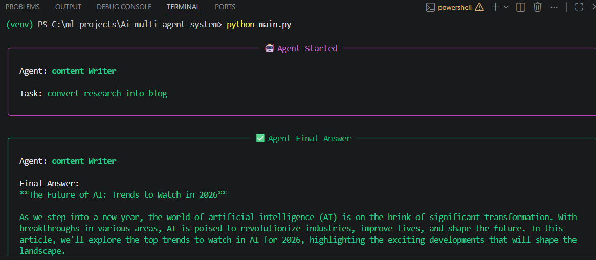

# 🤖 Multi-Agent AI System (CrewAI + Groq)

## 🚀 Overview

This project is a modular multi-agent AI system built using CrewAI with support for Groq (Llama3) 

## ✨ Features

* Multi-agent collaboration (Researcher + Writer)
* LLM provider switch (Groq / OpenAI)
* Tool integration (search capability)
* Modular architecture (production-ready structure)

## ⚙️ Setup

```bash
git clone https://github.com/yourusername/ai-multi-agent-system
cd ai-multi-agent-system
pip install -r requirements.txt
```

Create `.env`:

```
GROQ_API_KEY=your_key
```

## ▶️ Run

```bash
python main.py
```


## 📸 Example Output




## 🔥 Tech Stack

* CrewAI
* LangChain
* Groq (Llama3)
* OpenAI (optional)

## 📌 Future Improvements

* Add real-time search API
* Memory system
* LangGraph workflow
* Web UI (Streamlit)

## 👨‍💻 Author

Ajit Rout
